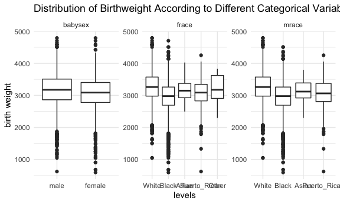
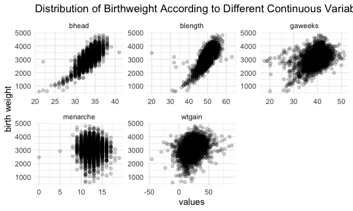
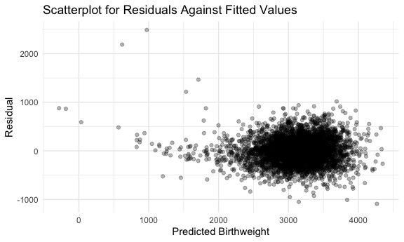
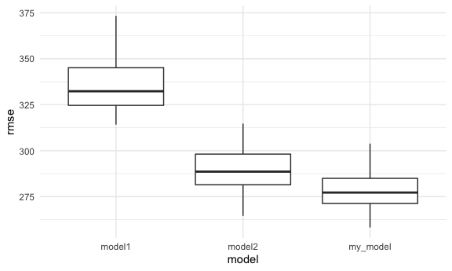
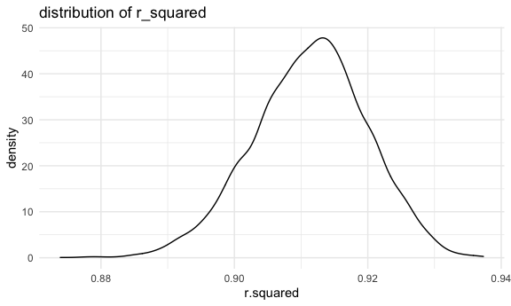
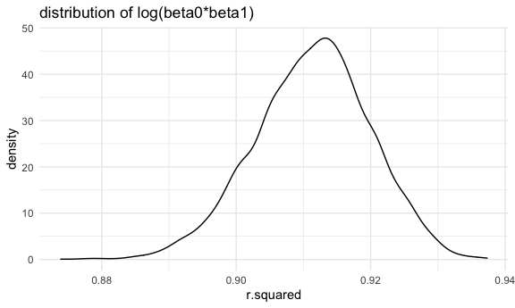

hw6
================
Yu Si
12/4/2021

``` r
library(tidyverse)
```

    ## ── Attaching packages ─────────────────────────────────────── tidyverse 1.3.1 ──

    ## ✓ ggplot2 3.3.5     ✓ purrr   0.3.4
    ## ✓ tibble  3.1.4     ✓ dplyr   1.0.7
    ## ✓ tidyr   1.1.3     ✓ stringr 1.4.0
    ## ✓ readr   2.0.1     ✓ forcats 0.5.1

    ## ── Conflicts ────────────────────────────────────────── tidyverse_conflicts() ──
    ## x dplyr::filter() masks stats::filter()
    ## x dplyr::lag()    masks stats::lag()

``` r
library(modelr)
library(mgcv)
```

    ## Loading required package: nlme

    ## 
    ## Attaching package: 'nlme'

    ## The following object is masked from 'package:dplyr':
    ## 
    ##     collapse

    ## This is mgcv 1.8-36. For overview type 'help("mgcv-package")'.

``` r
knitr::opts_chunk$set(
  fig.width = 6,
  fig.asp = .6,
  out.width = "90%"
)

theme_set(theme_minimal() + theme(legend.position = "bottom"))

options(
  ggplot2.continuous.colour = "viridis",
  ggplot2.continuous.fill = "viridis"
)

scale_colour_discrete = scale_colour_viridis_d
scale_fill_discrete = scale_fill_viridis_d
```

## Problem 1

``` r
#Data clean
birthweight_df = read_csv("birthweight.csv")
```

    ## Rows: 4342 Columns: 20

    ## ── Column specification ────────────────────────────────────────────────────────
    ## Delimiter: ","
    ## dbl (20): babysex, bhead, blength, bwt, delwt, fincome, frace, gaweeks, malf...

    ## 
    ## ℹ Use `spec()` to retrieve the full column specification for this data.
    ## ℹ Specify the column types or set `show_col_types = FALSE` to quiet this message.

``` r
birthweight_df= 
  birthweight_df %>% 
    drop_na() %>% 
    mutate(
      babysex = fct_recode(factor(babysex), male = "1", female = "2"),
      frace = fct_recode(factor(frace), White = "1", Black = "2", Asian = "3", Puerto_Rican = "4", Other = "8"),
      malform = fct_recode(factor(malform), absent = "0", present = "1"),
      mrace = fct_recode(factor(mrace), White = "1", Black = "2", Asian = "3", Puerto_Rican = "4")
    )
```

There is a sense that baby’s head circumference at birth is positively
correlated to baby’s birth weight and at the genetic level,mother’s race
plays a important role in baby’s birth weight. From my point of view,
the child’s birthweight should be associated with baby’s sex, baby’s
head circumference at birth, baby’s length at birth, gestational age,
mother’s age at menarche, mother’s race, father’s race, and mother’s
weight gain during pregnancy.

Let’s explore if the categorical variables I listed above have some
influence on the child’s birth weight!

``` r
birthweight_df %>% 
  select(bwt, babysex, frace, mrace) %>% 
  pivot_longer(
    cols = -bwt,
    names_to = "category",
    values_to = "levels"
  ) %>% 
  ggplot(aes(y = bwt, x = levels)) +
  geom_boxplot() +
  facet_wrap(. ~ category, scale = "free") +
  labs(
    y = "birth weight",
    title = "Distribution of Birthweight According to Different Categorical Variables"
  )
```



It seems that all of them will affect child’s birthweight. Then, let’s
take a look at continuous variables

``` r
birthweight_df %>% 
  select(bwt, bhead, blength, gaweeks, menarche, wtgain) %>% 
  pivot_longer(
    cols = -bwt, 
    names_to = "variables",
    values_to = "values"
  ) %>% 
  ggplot(aes(x = values, y = bwt)) +
  geom_point(alpha = .2) +
  facet_wrap(. ~ variables, scales = "free")+
  labs(
    y = "birth weight",
    title = "Distribution of Birthweight According to Different Continuous Variables"
  )
```



Based on the analysis, the age of mother at menarche does not have a
significant impact on birthweight, which we will remove that variable in
the model.

Here is the model:

``` r
my_model = lm(bwt ~ bhead + blength + gaweeks + wtgain + babysex + frace + mrace, data = birthweight_df)
```

\#Residuals in our model

``` r
birthweight_df %>% 
  modelr::add_residuals(my_model) %>% 
  modelr::add_predictions(my_model) %>% 
  ggplot(aes(x = pred, y = resid)) +
  geom_point(alpha = .3) +
  labs(
    title = "Scatterplot for Residuals Against Fitted Values",
    x = "Predicted Birthweight",
    y = "Residual"
  )
```



Compare with the other 2 model provided

``` r
model1 = lm(bwt ~ blength + gaweeks, data = birthweight_df)
model2 = lm(bwt ~ bhead + babysex + blength + bhead * babysex + bhead * blength + babysex * blength + babysex * blength * bhead, data = birthweight_df)
```

Test the model fit

``` r
set.seed(2)
cv_df = 
  crossv_mc(birthweight_df, 100) %>% 
  mutate(
    train = map(train, as_tibble),
    test = map(test, as_tibble)
  )

cv_df = 
  cv_df %>% 
  mutate(
    my_model = map(.x = train, ~ lm(bwt ~ bhead + blength + gaweeks + wtgain + babysex + frace + mrace, data = .x)),
    model1 = map(.x = train, ~lm(bwt ~ blength + gaweeks, data = .x)),
    model2 = map(.x = train, ~lm(bwt ~ bhead + babysex + blength + bhead * babysex + bhead * blength + babysex * blength + babysex * blength * bhead, data = .x))
    )%>% 
  mutate(
    rmse_my_model = map2_dbl(.x = my_model, .y = test, ~rmse(model = .x, data = .y)),
    rmse_model1 = map2_dbl(.x = model1, .y = test, ~rmse(model = .x, data = .y)),
    rmse_model2 = map2_dbl(.x = model2, .y = test, ~rmse(model = .x, data = .y))
  )

cv_df %>% 
  select(starts_with("rmse")) %>% 
  pivot_longer(
    everything(),
    names_to = "model",
    values_to = "rmse",
    names_prefix = "rmse_") %>% 
  ggplot(aes(x = model, y = rmse)) +
  geom_boxplot()
```



The plot above compared the prediction error of three models. The model
using baby’s length at birth has the highest average rmse compared to
other two models, indicating a worse fitting of this model. The model I
provided seems to have the smallest rmse among the three models which
means it predicts the child’s birth weight better than other two models
provided.

## Problem 2

``` r
weather_df = 
  rnoaa::meteo_pull_monitors(
    c("USW00094728"),
    var = c("PRCP", "TMIN", "TMAX"), 
    date_min = "2017-01-01",
    date_max = "2017-12-31") %>%
  mutate(
    name = recode(id, USW00094728 = "CentralPark_NY"),
    tmin = tmin / 10,
    tmax = tmax / 10) %>%
  select(name, id, everything())
```

    ## Registered S3 method overwritten by 'hoardr':
    ##   method           from
    ##   print.cache_info httr

    ## using cached file: ~/Library/Caches/R/noaa_ghcnd/USW00094728.dly

    ## date created (size, mb): 2021-10-19 00:17:44 (7.606)

    ## file min/max dates: 1869-01-01 / 2021-10-31

``` r
set.seed(1)
boot_straps = 
  weather_df %>% 
  modelr::bootstrap(n = 5000) %>% 
  mutate(
    model = map(strap, ~lm(tmax~tmin, data = .x)),
    glance = map(model, broom::glance),
    results = map(model, broom::tidy)
  ) %>% 
  unnest(glance) %>% 
  select(.id, r.squared, results) %>% 
  unnest(results) %>%
  mutate(
    term=str_replace(term,"\\(Intercept\\)","Intercept")
  ) %>% 
  pivot_wider(
    names_from = term,
    values_from = estimate
  ) %>% 
 group_by(.id) %>% 
  summarise(intercept = max(Intercept, na.rm = TRUE),
            tmin = max(tmin, na.rm = TRUE),
            r.squared = mean(r.squared)) %>% 
  mutate(
    result = log(intercept*tmin)
  )
boot_straps %>% 
  ggplot(aes(x = r.squared)) + geom_density()+
  labs(title = 'distribution of r_squared')
```



``` r
boot_straps %>% 
  ggplot(aes(x = r.squared)) + geom_density()+
  labs(title = 'distribution of log(beta0*beta1)')
```



Both r\_squared and log(beta0\*beta1) follows normal distribution, which
align with central limit theorem.

``` r
boot_straps %>% 
  summarize(
    r_squared_ci_lower = quantile(r.squared, 0.025), 
    r_squared_ci_upper = quantile(r.squared, 0.975),
    result_ci_lower = quantile(result, 0.025), 
    result_ci_upper = quantile(result, 0.975)) %>% 
  knitr::kable(caption = '95% CIs')
```

| r\_squared\_ci\_lower | r\_squared\_ci\_upper | result\_ci\_lower | result\_ci\_upper |
|----------------------:|----------------------:|------------------:|------------------:|
|             0.8936684 |              0.927106 |          1.964949 |          2.058887 |

95% CIs
